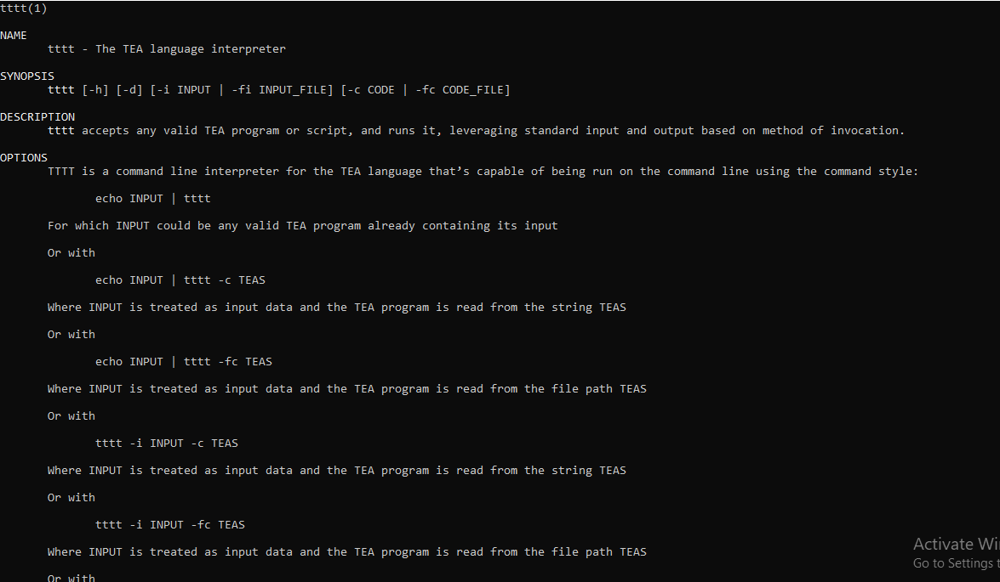
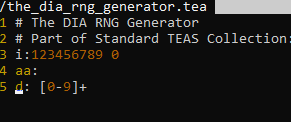
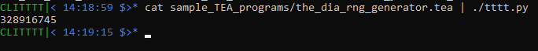
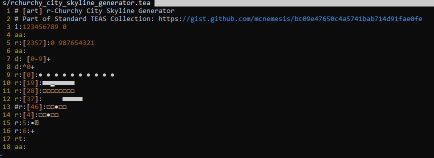
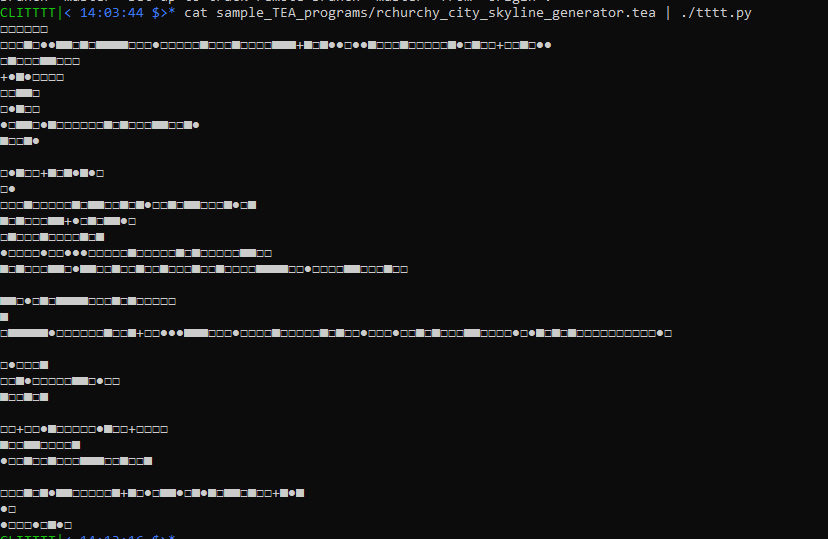

# TTTT: TEA Text Transformer Terminal
--------------------------------------------------------------------
 TEA, which is the TExt Alternating language is implemented here
 using the Python programming language as the base/host language.
--------------------------------------------------------------------
 The original TEA implementation is found in the TTTT Android app
 accessible via https://bit.ly/grabteas

 This commandline implementation of the TTTT is meant to extend the
 access of TEA to all major operating systems, by creating a standalone
 TEA interpreter that can be utilized in scripts or on the commandline.
 
---------------------------------------------------------------------
### CORE IMPLEMENTOR: Joseph W. Lutalo (jwl@nuchwezi.com, joewillrich@gmail.com)
---------------------------------------------------------------------

# QUICK TIPS:

1. To INSTALL TTTT and the TEA language on your system, run the following command in your terminal:

   > curl -Ls https://bit.ly/installtea | bash

2. To See TEA documentation and some example programs:

   > man tttt

==================== CLI TTTT Highlights ============================
- TEA is well documented

- Implementing RNGs in TEA

- Generating ART in TEA

==================== CLI TTTT Design ================================

echo INPUT | tttt

INPUT is considered to be a valid TEA program (possibly already containing its input), and is executed as such

Or with

echo INPUT | tttt -c CODE

Where INPUT is treated as input data and the TEA program is read from the string CODE

Or with

echo INPUT | tttt -fc FCODE

Where INPUT is treated as input data and the TEA program is read from the file path FCODE

Or with

tttt -i INPUT -c CODE

Where INPUT is treated as input data and the TEA program is read from the string CODE

Or with

tttt -i INPUT -fc FCODE

Where INPUT is treated as input data and the TEA program is read from the file path FCODE

Or with

tttt -fi INPUT -fc FCODE

Where INPUT is treated as data input file path and the TEA program is read from the file path FCODE

In all situations, the TTTT interpreter executes the available TEA program on the available input data and outputs the final result via standard output, and does nothing else but quit.
