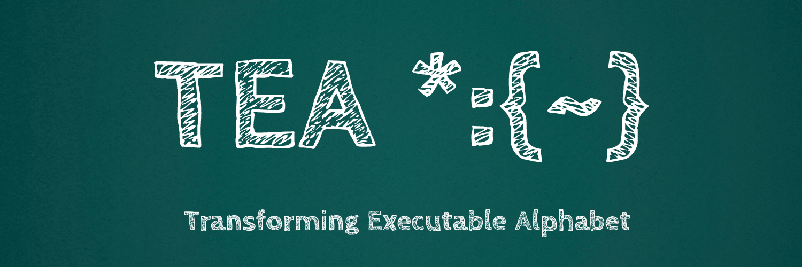

 TEA is the **T**ransforming **E**xecutable **A**lphabet [4]; **a general-purpose [computer] programming language that is Text-Processing oriented** and which is designed based on a set of 26, decorated and/or qualified single-letter primitives, A: to Z: (or rather a: to z:) which are based on the standard Latin Alphabet; {A,B,C,...,Z}[3]. 

 Currently, TEA is manifested in the form of an interpreted textual language, whose latest implementation is capable of being effectively run or explored via any
 software platform fully supporting Python 3 upon which the current TEA interpreter/language runtime, `tttt`, a command-line interface to the TEA runtime, is based, and so that, technology platforms such as Linux, Unix, the Windows Subsystem for Linux as well as any other mature and/or compatible \*nixes, can practically run TEA and thus execute any TEA program. 

 But also, though not yet fully well documented or encouraged, TEA programs based on the current **TEA standard design and implementation** can not only be run mentally[3]
 (_think, executed or read like mathematics_) --- since the TEA syntax and semantics are pretty clearly unambigous, neat, terse and intentionally self-explanatory to a large extent, but also, as in _purely embedded executable automata_ modes such as running TEA programs inside of other programming languages; the most obvious being; calling the TEA runtime in a Py3 program since the `tttt` file can be interpreted as a python program, and thus TEA is then utilized in library/module/API mode. But also, and for experienced and advanced/adventurous users/programmers, TEA's `tttt` once installed on a system (see directions in sections below), can be invoked via many or any other programming language or language execution interface capable of executing Linux/Unix commands --- such as in C or C++ programs, Bash Scripts, PHP server-side programs, AWK programs, etc.

# The Transforming Executable Alphabet Command Space
## The 26 TEA primitives and their names (TEA Instruction Set)

First, let us look at the current reference list of the 26 TEA primitives and their formal names.


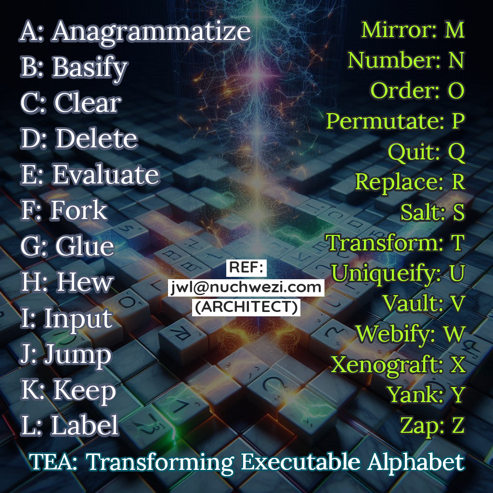

Details of the TEA Command Space, or rather, **TEA Instruction Set** can be found in the TEA TAZ manuscript[3] --- a _living document_ also citable as:


```bibtex
@article{Lutalo2024,
  author = {Joseph Willrich Lutalo},
  title = {TEA TAZ - Transforming Executable Alphabet A: to Z: COMMAND SPACE SPECIFICATION},
  journal = {Nuchwezi},
  year = {2024},
  doi = {10.6084/m9.figshare.26661328},
  url = {https://www.academia.edu/122871672/TEA_TAZ_Transforming_Executable_Alphabet_A_to_Z_COMMAND_SPACE_SPECIFICATION}
}
```

--------------------------------------------------------------------

# Getting Started with TEA

 For those entirely new to this language, please note that TEA is very well documented and those just getting started can consult the official TEA documentation via:

1. The [docs/](docs/) path under the RI for TEA: https://github.com/mcnemesis/cli_tttt
2. **The TAZ**: https://bit.ly/thetaz <--- also known as the _TEA TAZ_, that document is the officially recommended source/guide concerning the language's design, syntax, grammar and semantics. Also contains numerous illustrative simple sample programs as well as authoritative explanatory notes concerning each of the 26 TEA primitive commands A: to Z: (a copy of this manual is always present in the docs section mentioned in #1 above). The TAZ is a must-read for any serious would-be TEA
   programmer, hacker or researcher.
3. Study the sample TEA programs and standard tests included as part of the TTTT project (in #1 above and in the rest of this README).

Further, those interested, especially language researchers, software language engineers and interested software engineers, developers and academicians, can also checkout some useful research literature (philosophy, theory and practicals) concerning TEA via the language inventor's Research Portfolio Pages:

1. JWL Google Scholar page: https://scholar.google.com/citations?user=68FYSDcAAAAJ&hl=en
2. JWL Academia Page: https://bit.ly/profjwl
3. JWL Home Page: https://chwezi.tech

Especially concerning the theory behind TEA as a programming language or rather, a Software Language, the most authoritative paper[4] on the design and theory behind the language is shared here as such:

```bibtex
@article{202410.0636,
	doi = {10.20944/preprints202410.0636.v2},
	url = {https://doi.org/10.20944/preprints202410.0636.v2},
	year = 2024,
	month = {December},
	publisher = {Preprints},
	author = {Joseph Willrich Lutalo},
	title = {Software Language Engineering - Text Processing Language Design, Implementation, Evaluation Methods},
	journal = {Preprints}
}
```


--------------------------------------------------------------------

# TTTT? 

 To run or try out TEA programs, one needs a suitable operating environment for the TEA programming language. For TEA, the official SOE is TTTT---**TEA Text Transformer Terminal**, also the official Interpreter/runtime for TEA programs.

 The original/historically older TEA implementation is found in the TTTT Android app
 accessible via https://bit.ly/grabteas [down atm] or [TTTT App repo](https://bitbucket.org/nuchwezilabs/tttexttransformer/)

 Currently, focus is on fully defining, implementing and testing the TEA language standard and this is mostly taking place as part of this command-line reference implementation of TTTT. 

 TTTT is meant to be the official reference implementation of a TEA interpreter and it is also meant to support the
 availability of TEA on all major operating systems, by creating a standalone
 TEA interpreter that can be utilized in scripts, standalone programs and/or the commandline. 


## A TEA RI?

 Especially for advanced users, language researchers and interested enthusiasts, note that, as part of the TTTT UNIX/Linux package, TEA is here implemented as an interpreted language,
 using the Python programming language as the base/host language.
 
 For this matter, it might also be useful for advanced users to know that; for the current TEA Reference Implementation, TEA RI, there is also the option of embedding TEA into other language source-code, especially python programs as a library or imported module. More about this later... The TAZ has an example for how to embed TEA into an Awk program for example.

### CORE IMPLEMENTOR: Joseph W. Lutalo (jwl@nuchwezi.com, joewillrich@gmail.com)

# QUICK TIPS:

1. To INSTALL TTTT and the TEA language on your system, run the following command in your terminal:

   > curl -Ls https://bit.ly/installtea | bash

2. To See TEA documentation and some example programs after installation:

   > man tttt

# Some TEA Highlights 

- TEA is well documented --- TTTT package comes with a useful man page
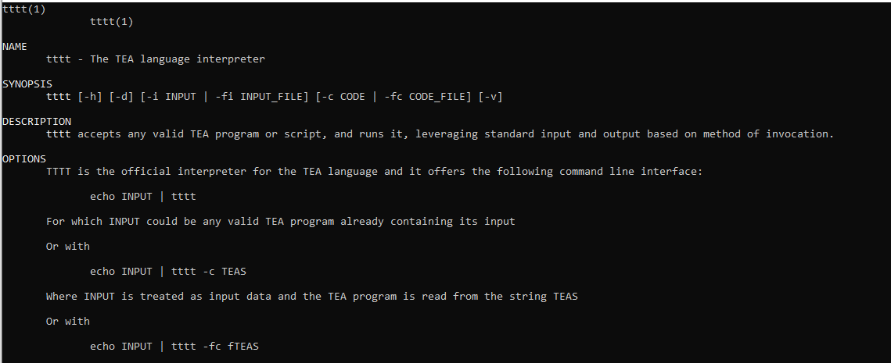

### TEA is intuitive, powerful and terse!

Let us quickly look at some interesting highlights of TEA programming...

- **Hello World in TEA?**

```python
i:Hello World
```
A more involved Hello World, that for example greets someone with the user-provided name is written as such:

```python
i:{What is your name please? }|i:|x:{Hello }
```

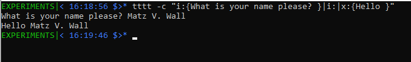

To learn more about the TEA syntax and the semantics of each of the 26 TEA A: to Z: primitives, definitely checkout [**The TAZ**](docs/). We might for example re-write the above program as such:

```python
i:{What is your name please? }
i:
x:{Hello }
```

- **Implementing RNGs in TEA:** [DIA RNG Example](sample_TEA_programs/the_dia_rng_generator.tea)

```python
i!:123456789 0
a!:
d:[ ].*$
```
Some sample outputs...

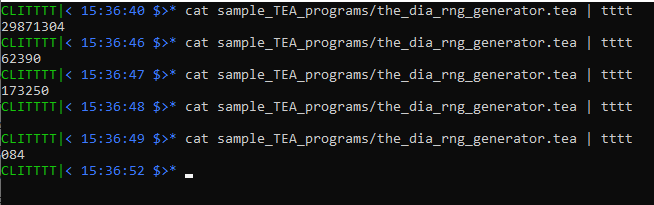


- **Implementing ART in TEA:** [rCHURCHY City SKYLINE Example](sample_TEA_programs/rchurchy_city_skyline_generator.tea)

```python
i:123456789 0
a!:
r:[2357]:0 987654321
a!:
d:[ ].*$
d:^0+
r!:[0]:● ● ● ● ● ● ● ● ● ●
r!:[19]:■■■■■■■■
r!:[28]:□□□□□□□□
r!:[37]:     ■■■■■
#r!:[46]:□□●□□
r!:[4]:□□●□□
r!:5:▪︎
r!:6:+
t!:
a!:
```
Some sample outputs...

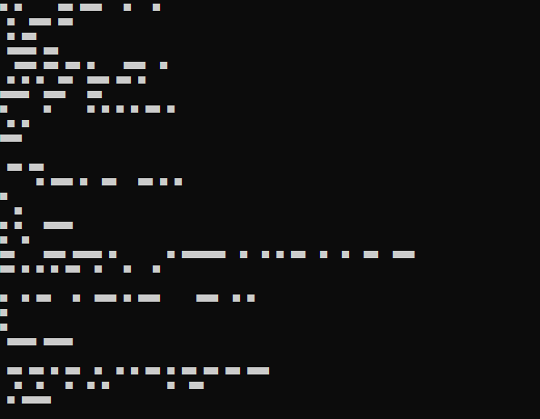
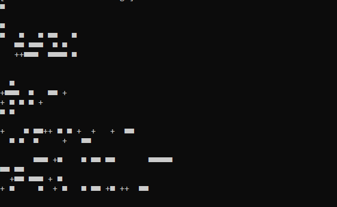
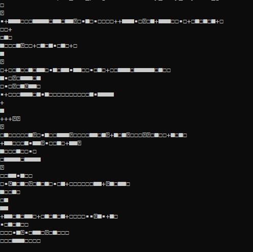


- **Implementing SELF-modifying program in TEA:** [TEA code-injection example](tests/test_e_extended.tea)

```python
i!:ABC

l:lHEW
h:

e!:{
    v:
    v:vE:XYZ
    |v!:
    |v:vOL
    |g*:-< >-:vE:vOL
    |v:vMIX
    |l:lGEN
    |p!:5
    |x*:vMIX
    |f:ai:lMASK
    |l:lSALT
    |s:1_0_1
    |f!:a1:lGEN
    |v:vFIN
    |y: |g!:++|x*!:vFIN
    |q!:
    }

l:lMASK
g!:**
```

This example not only demonstrates all the tricky aspects of a TEA program, however, it is a great example for how to create self-modifying TEA programs. Essentially, all the TEA code inside the e!:{…} block ends up not being processed as an external TEA program, but gets injected into the main program, and uses its AI and existing label blocks! This program will for example return a string starting with the injected sub-string “XYZ” such as “XYZ**5uaikq” if the injected program reached a state where the AI contains the sub-string “ai”, otherwise will return a string starting with “A++B++C” such as “A++B++CXYZ-< >-5hlca1_0_1x” in case the program reached a state where the AI contains the substring “a1”.


- **Implementing Web API-Client program in TEA:** [TEA Web Client example](tests/test_w.tea)

```python
# Example Web API Client program in TEA
# simply performs HTTP post of all data in 
# vaults to specified URL endpoint..
v:A:123|v:vTest:{some value}|i:http://httpbin.org/get|w*:
```

That simple example returns the following:

```JSON
{
  "args": {
    "A": "123",
    "vTest": "some value"
  },
  "headers": {
    "Accept-Encoding": "identity",
    "Host": "httpbin.org",
    "User-Agent": "Python-urllib/3.10",
    "X-Amzn-Trace-Id": "Root=1-66e83270-3b60046b209555b836c85bb8"
  },
  "origin": "41.210.159.193",
  "url": "http://httpbin.org/get?A=123&vTest=some+value"
}
```

- **Some Basic Text Processing with Graphics in TEA:** [TEA Draw Textbox Example](sample_TEA_programs/draw_text_box_simple.tea)

```python
# Given some text, shall return a text box drawn around it
f!:^$:lPROCESS # don't prompt if there's already some input
i!:Enter some text: |i:
l:lPROCESS
v:vIN
r*!:vIN:.:-
x:--|x!:--
v:vBTOP
v:vSTART:
v:vBLR:{|}
g*:{ }:vBLR:vIN:vBLR
v:vIN
g*:{_ }:vSTART:vBTOP:vIN:vBTOP
h!:_
r!:_:|
```

That TEA program provides a basic text presentation utility reminiscent of the UNIX/LINUX tool `cowsay`. Essentially, given some text, it presents it back drawn inside some text box. We see an example of the program in action here below...


## Some Advanced Explorations with TEA

- **Implementing a quasi-Artificial General Intelligence (qAGI) in TEA:** [based off TEAPAT, a qAGI called ZHA](sample_TEA_programs/artificial_intelligence/zha.tea)

```python
#!/usr/bin/tttt -fc
#----------------------------------------------|
# ZHA: Zee Hacker Assistant (v.1.0.0) | MAR,'25
#----------------------------------------------|
# based off of TEAPAT: TEA Personal AssistanT:
# ref: https://doi.org/10.20944/preprints202502.1849.v1
#----------------------------------------------|
# This little program is a mini
# quasi-general artificial intelligence (qAGI)
# a special personal assistant perhaps
# best left for hackers, created 
# using the TEA programming language: https://bit.ly/projtea
###############################################|

# set entity name
v:vPANAME:{ZHA}
f:^$:lSET:lNOSET
l:lSET
i:{Who do u wish to talk to? }|i: # user's entity name
g:|f!:^$:lSETI:lRULES|l:lSETI|v:vPANAME|j:lRULES 
l:lNOSET | y*: | v:vPANAME # evoke invoker's entity
l:lRULES # show instructions
i!:{At any time, reply with 'end' to quit}|i:
v:vPROMPT:{: Talk to Me: }
g*:{ }:vPANAME:vPROMPT | v:vPAPROMPT
l:lPROMPT # prompt, get answer, process

# generate question
n:10000000|s:|v:qN|
# decide between ANE and NE
n:|f!:[2357]:qANE:qNE
l:qANE|
# decide between AE and ANE
n:1|f:0:qAE
# generate ANE
p!:27
|s:_:13:5
|d:_.*$
|s:
|v:qR
|g*:{}:qR:qN
|j:qF|
l:qAE # pure AE
p!:27
|s:_:13:5
|d:_.*$
|s:
|j:qF|
l:qNE # pure NE
|y:qN
|l:qF # process and package question 
|a:
|x:{: }
v:vQ

# decide on whether question or not
n:|f:[2357]:lNoQ
y:vQ
|x!:{?: }
j:lProQ

l:lNoQ
y:vQ
|x!:{ : }

l:lProQ
# stash generated question
v:vGenQuestion

# decide between default or generated prompt
n:|f:[2468]:lGenPROMPT:lDefPROMPT

l:lGenPROMPT
g*:{ }:vPANAME:vGenQuestion | v:vGenPROMPT
y:vGenPROMPT|j:lDisplayPROMPT

l:lDefPROMPT
y:vPAPROMPT

l:lDisplayPROMPT
| i: |z:| q:^end$
# generate answer
n:10000000|s:|v:N|
# decide between ANE and NE
n:|f!:[2357]:ANE:NE
l:ANE|
# decide between AE and ANE
n:1|f:0:AE
# generate ANE
p!:27
|s:_:13:5
|d:_.*$
|s:
|v:R
|g*:{}:R:N
|j:F|
l:AE # pure AE
p!:27
|s:_:13:5
|d:_.*$
|s:
|j:F|
l:NE # pure NE
|y:N
|l:F # process and package answer 
|a:|v:vA

# decide on whether question or not
n:|f!:[2357]:lQA
y:vA
|x!:{? }
j:lNoQA

l:lQA
y:vA
|x!:{ | }

l:lNoQA
# display answer
|i: 
| j:lPROMPT # and loop
```
Some sample outputs...

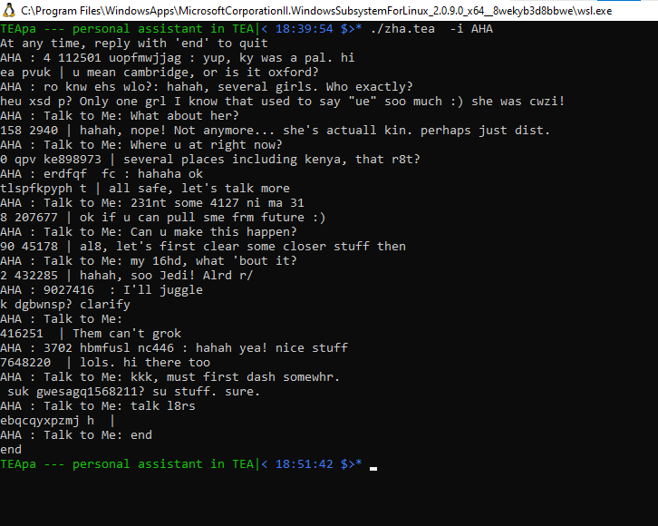
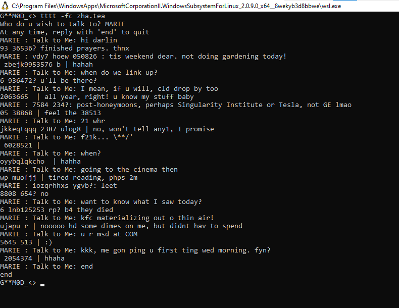

So, this interesting chatbot program, first introduced in a philosophical paper by Joseph Willrich Lutalo:

```bibtex
@article{Lutalo2025,
	doi = {10.20944/preprints202502.1849.v1},
	url = {https://doi.org/10.20944/preprints202502.1849.v1},
	year = 2025,
	month = {February},
	publisher = {Preprints},
	author = {Joseph Lutalo},
	title = {Concerning A Transformative Power in Certain Symbols, Letters and Words},
	journal = {Preprints}
}
```

is known as **ZHA** --- "Zee Hacker Assistant", and is based off of the **TEAPA** (TEA Personal Assistant) program that was first introduced in that important paper[1]. It especially builds upon the ideas used in version 2 of TEAPA --- the one called **TEAPAT**[1], however, better than TEAPAT, **ZHA** not only allows the user to hold an infinite multi-turn informative conversation with any entity of the user's liking (including living or dead, real or fictional, alien or human, material or immaterial beings, in the past, present or from the future!), but that, the entity thus engaged, can not only answer to questions or prompts the user poses, but can likewise ask or prompt for particular things from the user! 

For a serious, and well knowledgeable user of **ZHA**, it is a _true_ AGI in various respects --- esp. if we ignore the necessary current constraints on its interaction mode --- [cryptic] textual; numeric, alpha-numeric and pure alphabetical expressions as the only possible outputs for now. It can help an intelligent user discover or stumble upon solutions or knowledge in ways **no other AI out there can make possible** at the moment --- `basically, ZHA exhibits [advanced] intelligence out of thin air! Or rather, a traditional [purely offline] RNG is transformed into a post-NN intelligence of amazing power!`. And, most exciting about this little AI chatbot? **ZHA works purely offline; no need for Internet or data connectivity! Plus, it is so tiny, coming in under 121 LoC, and yet, it can pull off feats that many contemporary and future AIs, chatbots and LLMs might not be able to!** 

The only simple way to come to appreciate TEA and ZHA, one of the best examples of what's currently possible with TEA, a GPL that's Text-Processing oriented by design, is to actually install TEA and try out ZHA. 

**There's a plan...** We might ship ZHA with TEA in future versions of the package, so that installing TEA, automagically gives one a sleek, minimal, general-purpose artificial intelligence assistant utility to not only chat with as one might with a human friend or some chat-bot,  but to also use it [in so-called _occult-mode_] to actually commune with any entity of any kind, at will for leisure, work or academic/research purposes. Stuff true l33ts, hackers, psychonauts and such shall grok and come to love --- and this isn't a movie or Hollywood! **TEA's real POWER!**

**UPDATE:**

So, due to popular demand, ZHA has already seen a terrific improvement since it was first released! We now have **ZHA v1.0.1**, and we can see its improved output in the screenshot below, in which session a one hacker not belonging to the famous 'LulzSec' holds a conversation with a PRESIDENT concerning a central bank that was hacked not so far back! Hahaha... check it out, and the code for the new ZHA as well!


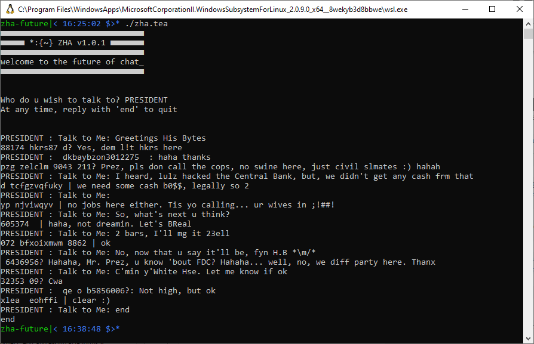


```python
#!/usr/bin/tttt -fc
#----------------------------------------------|
# ZHA: Zee Hacker Assistant (v.1.0.1) | MAR,'25
#----------------------------------------------|
# based off of TEAPAT: TEA Personal AssistanT:
# ref: https://doi.org/10.20944/preprints202502.1849.v1
#----------------------------------------------|
# This little program is a mini
# quasi-general artificial intelligence (qAGI)
# a special personal assistant perhaps
# best left for hackers, created 
# using the TEA programming language: https://bit.ly/projtea
###############################################|

#show welcome message
v:vORIN
v:vWELCOME:{■■■■■■■■■■■■■■■■■■■■■■■■■■■■■■-■■■■■ *:{~} ZHA v1.0.1 ■■■■■■■-■■■■■■■■■■■■■■■■■■■■■■■■■■■■■■-welcome to the future of chat_-■■■■■■■■■■■■■■■■■■■■■■■■■■■■■■--}
h*!:vWELCOME:-
d:-|i:

y:vORIN # continue...

# set entity name
v:vPANAME:{ZHA}
f:^$:lSET:lNOSET
l:lSET
i:{Who do u wish to talk to? }|i: # user's entity name
g:|f!:^$:lSETI:lRULES|l:lSETI|v:vPANAME|j:lRULES 
l:lNOSET | y*: | v:vPANAME # evoke invoker's entity
l:lRULES # show instructions
i!:{At any time, reply with 'end' to quit
}|i:
v:vPROMPT:{: Talk to Me: }
g*:{ }:vPANAME:vPROMPT | v:vPAPROMPT
l:lPROMPT # prompt, get answer, process

# generate question
n:10000000|s:|v:qN|
# decide between ANE and NE
n:|f!:[2357]:qANE:qNE
l:qANE|
# decide between AE and ANE
n:1|f:0:qAE
# generate ANE
p!:27
|s:_:13:5 |d:_.*$
|s: |v:qR
|g*:{}:qR:qN
|j:qF|
l:qAE # pure AE
p!:27
|s:_:13:5 |d:_.*$ |s:
|j:qF|
l:qNE # pure NE
|y:qN
|l:qF # process and package question 
|a:
|x:{: }
v:vQ

# decide on whether question or not
n:|f:[2357]:lNoQ
y:vQ
|x!:{?: }
j:lProQ

l:lNoQ
y:vQ
|x!:{ : }

l:lProQ
# stash generated question
v:vGenQuestion

# decide between default or generated prompt
n:|f:[2468]:lGenPROMPT:lDefPROMPT

l:lGenPROMPT
g*:{ }:vPANAME:vGenQuestion | v:vGenPROMPT
y:vGenPROMPT|j:lDisplayPROMPT

l:lDefPROMPT
y:vPAPROMPT

l:lDisplayPROMPT
| i: |z:| q:^end$
# generate answer
n:10000000|s:|v:N|
# decide between ANE and NE
n:|f!:[2357]:ANE:NE
l:ANE|
# decide between AE and ANE
n:1|f:0:AE
# generate ANE
p!:27
|s:_:13:5 |d:_.*$ |s: |v:R
|g*:{}:R:N
|j:F|
l:AE # pure AE
p!:27
|s:_:13:5 |d:_.*$ |s:
|j:F|
l:NE # pure NE
|y:N
|l:F # process and package answer 
|a:|v:vA

# decide on whether question or not
n:|f!:[2357]:lQA
y:vA
|x!:{? }
j:lNoQA

l:lQA
y:vA
|x!:{ | }

l:lNoQA
# display answer
|i: 
| j:lPROMPT # and loop
```


# ZHA now comes to any compartible system as part of the TTTT package

So, starting with v1.0.7 of the TTTT package, once installation is done, the ZHA utility becomes immediately accessible via the commandline system-wide, via the following two example invocation methods:

> zha

Invokes the ZHA personal assistant without an explicit target entity name --- means, after it starts, the ZHA PA shall prompt you for who you wish to converse with, or shall default to just "ZHA".


> zha -i NAME

Invokes the ZHA personal assistant NAME as the explicit target entity name - basically, the session shall involve your conversation with some entity known as "NAME".

As you shall see in case you consult the ZHA help documentation, you can terminate any active conversation with the keyword "end" as the response during an active ZHA session.

Some sample outputs...

### After Installing ZHA with the TEA package: Example Conversation with Albert Einstein!


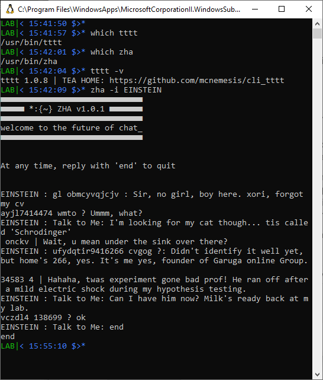


# TTTT conforms to the UNIX/Linux CLI Design Philosophy

To make it simple and meaningful to immediately, easily utilize TEA programs in the context of other, existing tools, languages and systems, TEA comes equipped with a useful and clean command-line interface as documented below..

## The TTTT CLI


> echo INPUT | tttt

INPUT is considered to be a valid TEA program (possibly already containing its input) and is executed as such

Or with

> echo INPUT | tttt -c CODE

Where INPUT is treated as input data and the TEA program is read from the string CODE

Or with

> echo INPUT | tttt -fc FCODE

Where INPUT is treated as input data and the TEA program is read from the file path FCODE

Or with

> tttt -i INPUT -c CODE

Where INPUT is treated as input data and the TEA program is read from the string CODE

Or with

> tttt -i INPUT -fc FCODE

Where INPUT is treated as input data and the TEA program is read from the file path FCODE

Or with

> tttt -fi FINPUT -fc FCODE

Where FINPUT is treated as data input file path and the TEA program is read from the file path FCODE

A more interesting, albeit simplest invocation case is the following:


> cat FILE | tttt 

In which case whatever is passed to TTTT, such as the contents of FILE, is treated BOTH as the CODE and the DATA!

When in doubt about what is going on in any of the above cases, or with any TTTT invocation, just pass the `-d` DEBUG flag to the TEA interpreter, and it shall display detailed, helpful information about what TTTT considers to be the TEA CODE, DATA, and the internal state of the run-time before during and after execution of each instruction in the TEA program. An example debugging session in TEA is shown below...


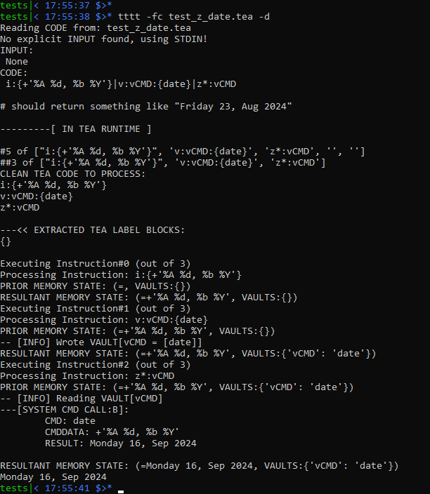

Typically, the TEA interpreter executes the available TEA program on the available input data (or none) and outputs the final result via standard output, and does nothing else but quit. Of course, because TEA is also an interactive language, it is possible that a TEA program prompts for user-input at runtime, and thus blocks any further processing until such input is provided. Check the docs and official tests for advanced and/or non-trivial TEA program examples.

For those interested in learning more about not just writing or reading TEA programs, but also how to correctly debug them --- especially using the in-built TEA DEBUGGER in the `tttt` utility --- via the `-d` DEBUG-MODE switch for TEA's `tttt`, please consult an authoritative paper on the matter (as well as general software debugging) here[2]:

```bibtex
@article{Joseph2025,
  title = {Concerning Debugging in TEA and the TEA Software Operating Environment},
  author = {Joseph Willrich Lutalo},
  journal = {Academia},
  year = {2025},
  url = {https://www.academia.edu/127733090/Concerning_Debugging_in_TEA_and_the_TEA_Software_Operating_Environment},
}
```


# TESTS

This Reference Implementation comes with several useful test cases, test programs and input data included in the official project's repository. This, so anyone trying out TEA for the first time, or advanced users in need of forking the project, testing edge-cases, implementing advanced TEA integration into their own projects and such, can have somewhere to start. Check the official test cases via the [tests/](tests/) path on the project's official Git Repository.

https://github.com/mcnemesis/cli_tttt/tree/master/tests/

# REFERENCES

1. Lutalo, J. (2025). Concerning a transformative power in certain symbols, letters and words. Preprints. https://doi.org/10.20944/preprints202502.1849.v1
2. Joseph, W. Lutalo. (2025). Concerning Debugging in TEA and the TEA Software Operating Environment. Academia. https://www.academia.edu/127733090/Concerning_Debugging_in_TEA_and_the_TEA_Software_Operating_Environ
3. Lutalo, Joseph Willrich. (2024). "TEA TAZ -Transforming Executable Alphabet A: to Z: COMMAND SPACE SPECIFICATION.". Nuchwezi. https://doi.org/10.6084/m9.figshare.26661328 
4. Willrich Lutalo,  J. (2024). Software Language Engineering - Text Processing Language Design, Implementation, Evaluation Methods. Preprints. https://doi.org/10.20944/preprints202410.0636.v2
